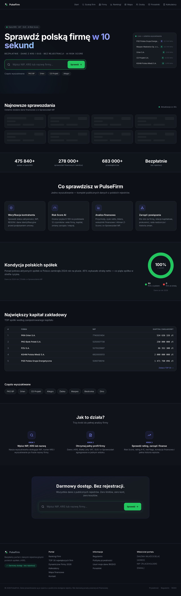

# Raport360.pl — Polish Company Intelligence Portal

> Full financial and legal analysis for 700,000+ Polish companies.

**Live:** [raport360.pl](https://raport360.pl) &nbsp;|&nbsp; **Status:** Work in progress

---

## What it does

- KRS registry data: board members, shareholders, PKD codes, registration history
- Financial statements from eKRS filings: revenue, net profit, assets, equity
- Risk rating A–E with Altman Z"-Score bankruptcy detection
- 30+ red flag signals: VAT compliance, dormant status, virtual office patterns, board turnover
- Interactive voivodeship heat map, company comparison, executive directory

## How it works

- **Multi-source pipeline**: Queries KRS API for company structure, VAT whitelist for tax status, and eKRS financial databases for historical statements — with Supabase cache populated by nightly scrapers when WAF blocks direct access
- **Altman Z"-Score**: Implements the academic bankruptcy prediction model (6.56·X1 + 3.26·X2 + 6.72·X3 + 1.05·X4) combined with 30+ heuristic red flag penalties
- **WAF bypass scraper**: Playwright with 20 parallel Chrome workers bypasses Incapsula WAF to extract financial XML/XHTML filings, processing ~14,000 companies/hour
- **Risk zone classification**: Scores companies into BEZPIECZNA / SZARA / RYZYKO zones combining financial model + operational signals

## Tech Stack

    
