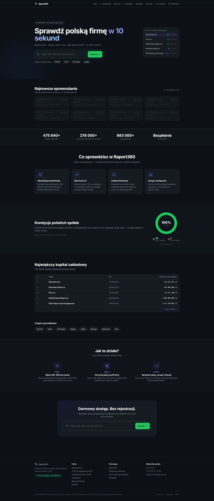

# Raport360

> Polish company intelligence — due diligence on KRS and CEIDG businesses in seconds.

## What is it

Raport360 is a platform for verifying and analyzing Polish companies. The database covers nearly 700,000 KRS companies and 683,000+ CEIDG sole traders. The system generates an automatic A-E rating, an Algorithmic Risk Score 0-100 based on 12 factors, and full due diligence with financial analysis from Ministry of Finance financial statements.

## Features

- **Algorithmic Risk Score** — risk assessment 0-100 based on company age, capital, management changes, Altman Z-Score
- **A-E Rating** — automatic financial health classification (A=safe, E=risky)
- **Financial analysis** — revenue, net profit, balance sheet, ratios from Ministry of Finance e-Reports
- **Management and connections** — proxies, supervisory board, change history, capital relationships
- **Contractor verification** — activity status, NIP, REGON, KRS identification data
- **Live Feed** — new entries and changes in KRS polled periodically
- **Company ranking** — Top 30 and dynamic industry rankings
- **Ratio calculator** — ROE, ROA, current ratio, quick ratio
- **Free without registration** — basic data available publicly

## Stack

| Layer | Technology |
|-------|-----------|
| Frontend | Next.js, React, TypeScript, Tailwind CSS |
| Backend | Next.js API Routes |
| Database | Supabase (PostgreSQL) |
| Charts | Recharts |
| Email | Resend |
| Icons | Lucide React |
| Deploy | Vercel |

## Status

Live — [raport360.pl](https://raport360.pl)

---
Built by [Emil Piński](https://emilpinski.pl)

> Source code is private. [Contact for collaboration](mailto:emilpinskidev@gmail.com)

## Screenshots

