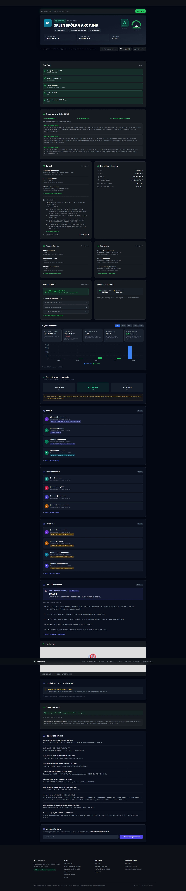

# Raport360

> Polish company intelligence — due diligence on KRS and CEIDG businesses in seconds.

## What is it

Raport360 is a platform for verifying and analyzing Polish companies. The database covers nearly 700,000 KRS companies and 683,000+ CEIDG sole traders. The system generates an automatic A-E rating, an Algorithmic Risk Score 0-100 based on 12 factors, and full due diligence with financial analysis from Ministry of Finance financial statements.

## Features

- **Algorithmic Risk Score** — risk assessment 0-100 based on company age, capital, management changes, Altman Z-Score
- **A-E Rating** — automatic financial health classification (A=safe, E=risky)
- **Financial analysis** — revenue, net profit, balance sheet, ratios from Ministry of Finance e-Reports
- **Management and connections** — proxies, supervisory board, change history, capital relationships
- **Contractor verification** — activity status, NIP, REGON, KRS identification data
- **Live Feed** — new entries and changes in KRS polled periodically
- **Company ranking** — Top 30 and dynamic industry rankings
- **Ratio calculator** — ROE, ROA, current ratio, quick ratio
- **Free without registration** — basic data available publicly

## Use cases

**Contractor verification before contract signing**
A procurement team checks a new supplier before signing a 200k PLN contract. Raport360 surfaces: company age (3 years), management changes in the last 12 months (2 changes - flag), Altman Z-Score in distress zone, and one active enforcement entry in KRS. Decision: additional due diligence required.

**Portfolio monitoring for a leasing company**
A fleet leasing company monitors 340 corporate clients. Monthly automated checks flag 4 companies with Risk Score increases above 15 points. Two are in restructuring proceedings; two changed registered address to a known virtual-office address used by 80+ entities.

**Investment screening**
A private equity analyst shortlists 12 acquisition targets in the manufacturing sector. Raport360 filters to 4 with Risk Score below 30, positive Altman Z, and consistent revenue growth over 3 years of e-Reports.

## Stack

| Layer | Technology |
|-------|-----------|
| Frontend | Next.js, React, TypeScript, Tailwind CSS |
| Backend | Next.js API Routes |
| Database | Supabase (PostgreSQL) |
| Charts | Recharts |
| Email | Resend |
| Icons | Lucide React |
| Deploy | Vercel |

## Data sources and freshness

| Source | Entities | Refresh frequency | Notes |
|--------|----------|------------------|-------|
| KRS (National Court Register) | ~700,000 companies | Weekly | Via official KRS API |
| CEIDG (sole traders) | 683,000+ | Weekly | Via official CEIDG API |
| MF e-Reports (financial statements) | ~400,000 with reports | On new filing | Ministry of Finance XML |
| VAT Whitelist (Biala Lista) | All active VAT payers | Daily | Via wl-api.mf.gov.pl |

## Status

Live — [raport360.pl](https://raport360.pl)

---
Built by [Emil Piński](https://emilpinski.pl)

> Source code is private. [Contact for collaboration](mailto:emilpinskidev@gmail.com)

## Screenshots

